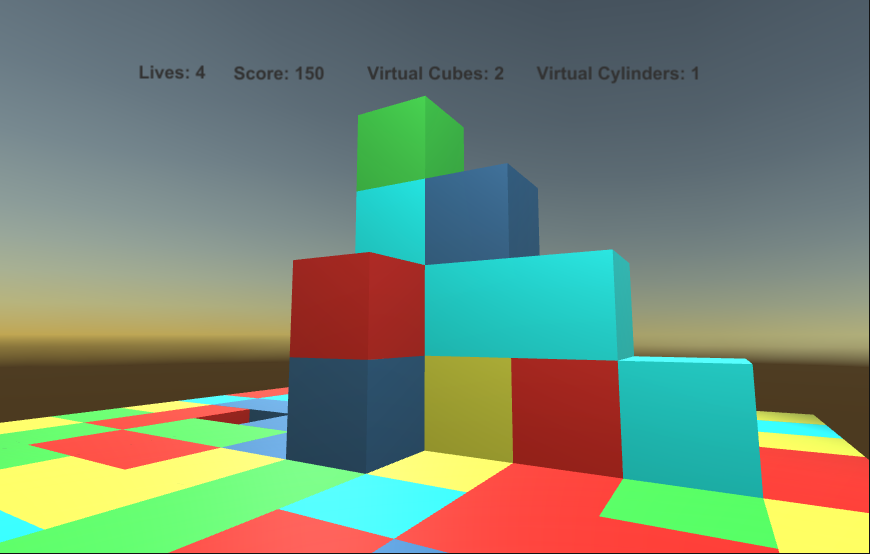

# Minecraft (Unity)

A simple 3D game like “Minecraft”. At the beginning of the game user give the size N of the scene (NxN). The idea of the game is that the player is initially placed on a floor paved with cubes of different colors and moves on the floor building, disappearing cubes, going up, down or falling. The player is one and starts with 100 points and 4 lives. The game lasts as long as the player has lives. The aim is for the player to collect as many points as possible. Operations that require units or a stock of cubes / cylinders are performed only if the corresponding stock does exist. The player can collect virtual cubes and cylinders by creating a stock with which he can later build cubes and cylinders.

<li>The game will start, player gives the grid and fill the grid floor (X, Y, 1) - also called level 1 - with cubes with one of the 5 colors (one color randomly selected for each cube from: red, blue, green, yellow, blue). The player will be placed initially in the center of level 2. The cube in the center will be magenta colored and cannot be destroyed (unlike all other cubes that can be destroyed by the player)</li>

 

  

<li>The movement is possible when there is no cube or cylinder in the same level with the player in the direction it will move and there is a cube in the level below the player. If there is nothing below, the player the player falls by one or more levels losing 10 points for each level that falls outside the first. If the player falls into the void or does not have enough points he loses one life. If there is only one cube or only one cylinder in front, then the player can jump on it and get 10 points. Finally, the player cannot get out of the grid.</li>

 

  

<li>The user's window shows the score and the remaining lives.</li>
<li>When the player presses the <b>&ltp&gt</b> key he takes a virtual cube from the cube he is looking at and increases his stock of virtual cubes by one while losing 5 points at the same time. The number of available virtual cubes depends on the color of the looking cube (1 for yellow, 2 for red, 3 for green and 0 for blue), also the looking cube changes color to show how many available virtual cubes are left after the player gets one or more virtual cubes (pressing <b>&ltp&gt</b> one or more times). Magenta cube and cylinders are out of stock. The light blue cube has in stock a virtual cylinder of the same color and gives to the player a virtual cylinder when he presses <b>&ltp&gt</b>, and then it is destroyed. When a light blue cube disappears, what is above it does not move.</li>
<li>When the player presses the <b>&ltb&gt</b> key he will place a random colored cube from the stock of virtual cubes in front of him at the same level, the stock of virtual cubes he has will be reduced by 1, and he will get 10 points. When there is another cube on the same level in front of it, the cube will be added to the largest free level.</li>

 

  

 

  

<li>If the user presses the <b>&ltc&gt</b> key, he places a cylinder in front of him (if he has a stock of cylinders), which is twice the height of the cube and its base has a diameter equal to the side of a cube, will reduce the stock of virtual cylinders that has by 1, and will get 20 points. Cylinders have no virtual stock of cubes or cylinders (cannot be destroyed)</li>

 

  

<li>When the player reaches (climbs a cube or cylinder) to level N, it takes one life and 100 points!</li>

 

  

<li>When the player presses <b>&ltq&gt</b> the cube in front of him at the same level as him will disappear.  When a cube disappears, what is above it does not move.</li>
<li>When the player presses <b>&ltx&gt</b> all the cubes in the front (X, Y) position and in any level (Z) will disappear, thus gaining one life but losing 20 points.</li>
<li>When the player presses <b>&ltr&gt</b> all the cubes that have no other bottom fall down until they meet another cube. If there is no such they disappear. This operation is done in steps to simulate the collapse. From this mode the player gets 30 points.</li>
<li>The player can "kick" the cube in front of him on the same level by pressing the <b>&ltk&gt</b> key. Then, this cube moves one by one where the player looks at the same level. If there is another in front of him, then it also moves forward, if a cube comes out of the grid it disappears.</li>

 

  

